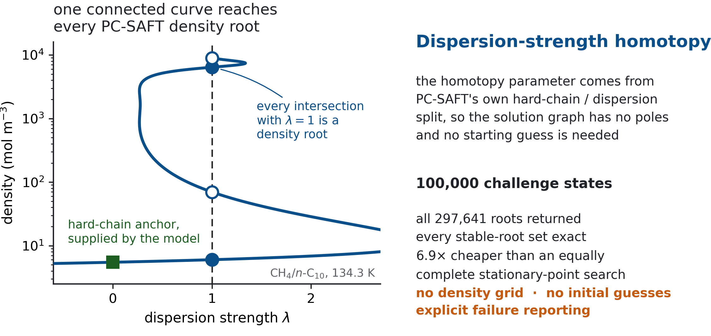
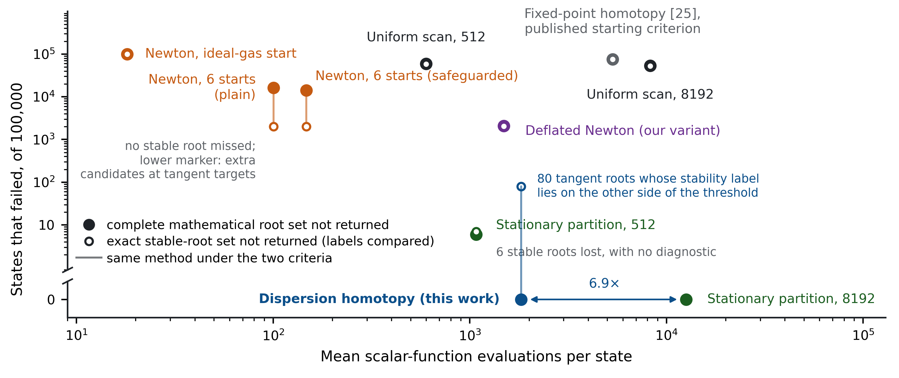
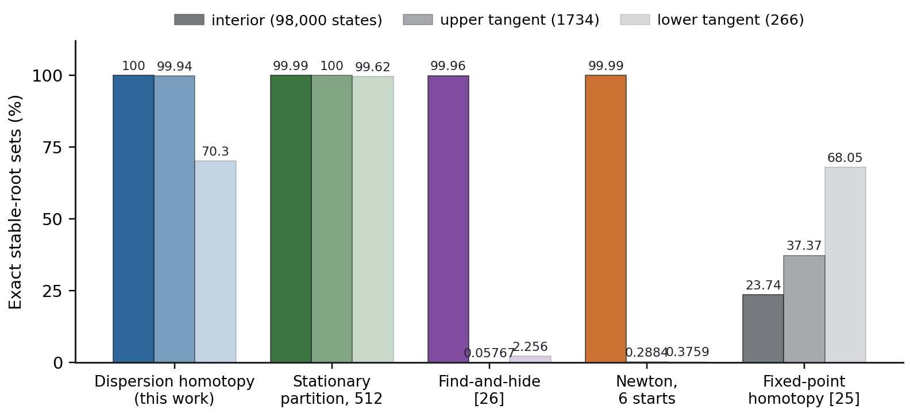
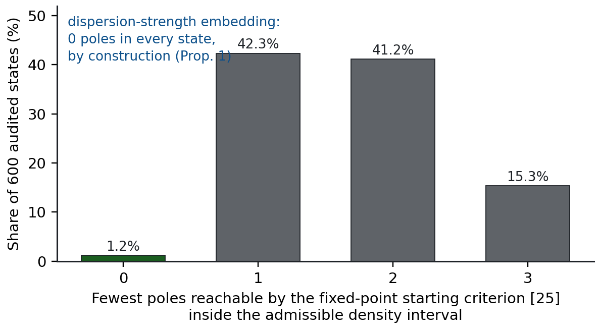
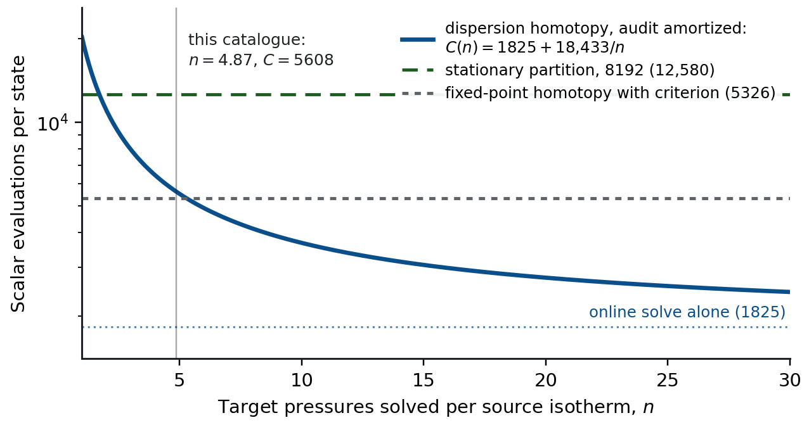
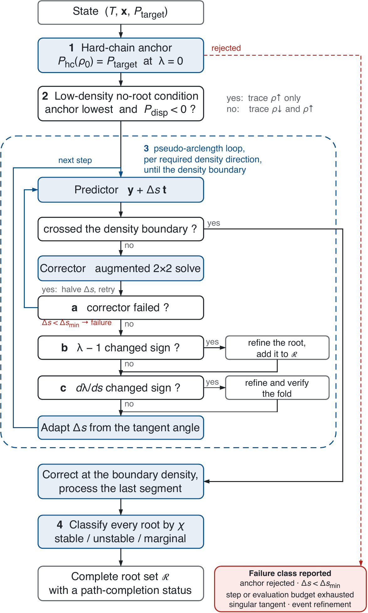

# PC-SAFT density root finding by dispersion-strength homotopy

Reference implementation for *A PC-SAFT Density Root-Finding Method Based on
Dispersion-Strength Homotopy and Pseudo-Arclength Continuation*
([SSRN preprint](https://papers.ssrn.com/sol3/papers.cfm?abstract_id=7201757)).

The solver embeds the PC-SAFT density equation in its own hard-chain /
dispersion split, traces the anchor-connected solution curve with adaptive
pseudo-arclength continuation, and returns every intersection with the full
model as a density root, classified by a dimensionless stability indicator.
It uses no density grid, no stationary-point partition, and no multi-start
rescue.



*The curve above is computed from the model itself for a four-root
CH$_4$/$n$-C$_{10}$ state: the hard-chain anchor at $\lambda=0$ is supplied
by PC-SAFT's own reference equation, and every intersection of the connected
curve with $\lambda=1$ is a density root of the full model.*

## Build

Requires a C++17 compiler and CMake 3.16+. No external dependencies.

```bash
cmake -S . -B build -DCMAKE_BUILD_TYPE=Release
cmake --build build -j
```

## 1. Smoke test — seconds

Solves one catalogue state and prints its classified root set beside roots
obtained independently by a stationary-point hierarchy.

```bash
./build/single_state_example              # a three-root state
./build/single_state_example --index 42   # any other catalogue state
```

Expected output ends with `returned 3 roots, reference 3 roots -> counts agree`.

## 2. Unit tests — under a minute

```bash
ctest --test-dir build --output-on-failure
```

`test_external_baselines` checks the fixed-point embedding algebraically before
it is used: the `lambda = 1` endpoint must reproduce the target model exactly,
the `lambda = 0` endpoint must have the anchor as its only root, and both
partial derivatives must agree with central differences.

## 3. Method comparison — reproduces Table 1 and Figure 3

Every method in Table 1 is evaluated on the same frozen catalogue against the
same independently verified reference roots.

```bash
# reduced catalogue, a few minutes
./build/external_baseline_benchmark --reference REFERENCE_ROOTS.csv \
    --output out_small --catalog validation --limit-per-group 250

# full 100,000-state catalogue as reported in the paper
./build/external_baseline_benchmark --reference REFERENCE_ROOTS.csv \
    --output out_full --catalog validation
```

`REFERENCE_ROOTS.csv` is `e2_root_results.csv` from the data archive. The full
run takes roughly two hours on one core of an Apple M4 Max; the reduced run is
representative to within a few tenths of a percent on every completeness
figure. Outputs are `cr_method_summary.csv` (per method),
`cr_class_summary.csv` (per method and target class) and
`cr_state_method_results.csv` (per state).



*Each filled marker is a method's failure count on the exact stable-root
set against its mean cost; the whisker rises to its failure count when the
intermediate root is also required. Only the dispersion homotopy and an
8192-interval stationary partition fail in no state, at costs 6.9$\times$
apart.*

## 4. Structural audit of the two embeddings — about a minute

Samples both solution graphs and counts the poles of each, and applies the
starting-point criterion of Aslam and Sunol (2006) over the admissible
interval.

```bash
./build/embedding_pole_audit --output out_poles --limit-per-group 150
```

## Further results

Three results the article states in prose, plotted here for space.

**Accuracy at tangent targets.** The tangent classes are the states adjacent
to phase appearance and disappearance, where a root sits at
dP/d&rho;&nbsp;&asymp;&nbsp;0. They are where the compared methods separate:



**Why the fixed-point transfer saturates.** The starting-point criterion of
ref. [25] tries to pick an anchor whose solution graph has no poles. Inside
the interval on which the rational PC-SAFT pressure is defined, the best
available anchor is pole-free in only 1.2% of audited states, and a trace
stopped by a pole cannot reach the roots beyond it. The dispersion-strength
graph has no poles by construction:



**What the one-time audit costs.** The structural audit is paid once per
source isotherm and reused for every target pressure on it, so its amortized
cost falls with the workload; the criterion scan of the fixed-point method is
paid on every state:



## Algorithm at a glance

<p align="center">

</p>

The loop tests three events per accepted step -- a failed corrector, a sign
change of &lambda;&nbsp;&minus;&nbsp;1 (a density root of the full model), and
a sign change of d&lambda;/ds (a fold) -- and terminates only when both traces
reach the boundaries of the admissible density domain, which is what the
returned completion status certifies.

## Layout

| Path | Contents |
|---|---|
| `include/complete_homotopy_curve.hpp` | the solver: predictor–corrector, event detection, fold handling, termination |
| `include/fixed_point_homotopy.hpp` | global fixed-point homotopy baseline and its published starting-point criterion |
| `include/deflation_root_methods.hpp` | deflated multi-start Newton, our own variant of the find-and-hide hiding step (the published procedure of ref. [26] is realized by the stationary-partition baseline) |
| `include/direct_root_methods.hpp` | Newton, uniform-scan and stationary-partition baselines |
| `include/reference_root_isolator.hpp` | independent stationary-point hierarchy used as reference |
| `include/pcsaft_*.hpp` | PC-SAFT pressure, derivatives and mixture combining rules |
| `include/*_catalog.hpp`, `src/*_catalog.cpp` | generators for the frozen state catalogues |

## Data

The frozen experiment outputs, model parameters and reference roots of the
original submission are archived separately; see the Data availability
statement of the article. The result tables added in revision are kept here
under `results/`:

| File | Contents |
|---|---|
| `results/cr_method_summary.csv` | per-method completeness under both criteria, missing stable roots, the three stability-threshold columns, evaluation counts and timings (Table 1 of the article) |
| `results/cr_class_summary.csv` | the same accuracy figures split by target class (interior, lower tangent, upper tangent) |
| `results/cr_pole_audit.csv`, `results/cr_pole_audit_report.txt` | the embedding pole audit on 600 catalogue states (Section 4.5 of the article) |

## Citing

If you use this software, please cite the accompanying article; a preprint is
available on [SSRN](https://papers.ssrn.com/sol3/papers.cfm?abstract_id=7201757).
Citation metadata for this repository is in `CITATION.cff`.

## Licence

MIT, see `LICENSE`.
